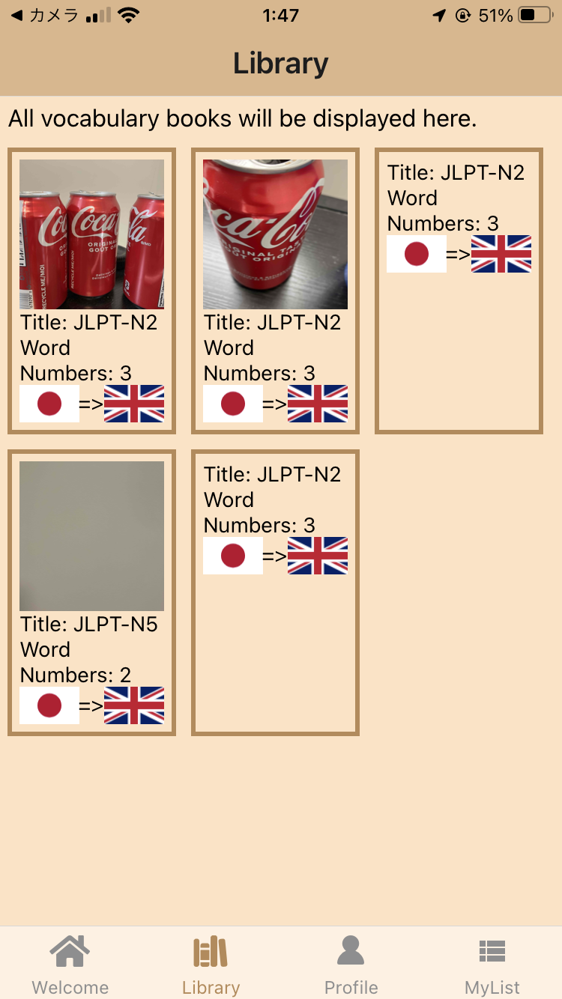
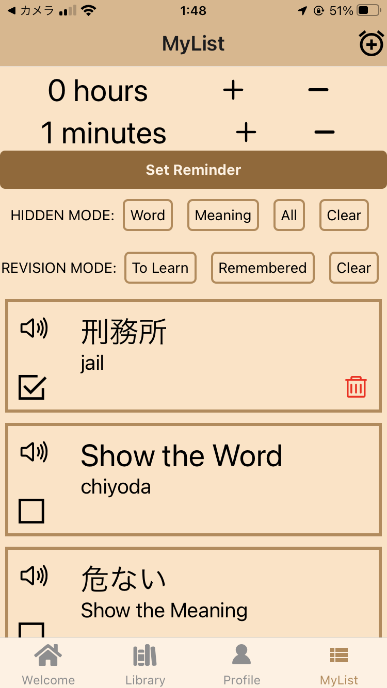
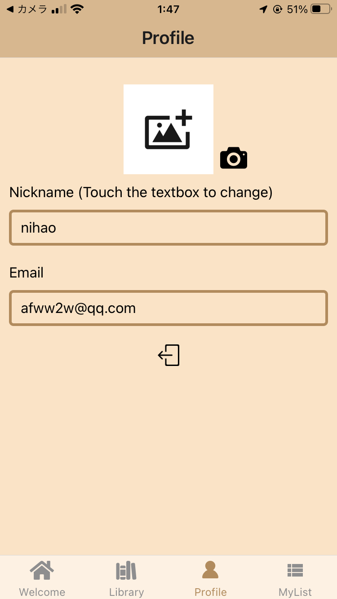
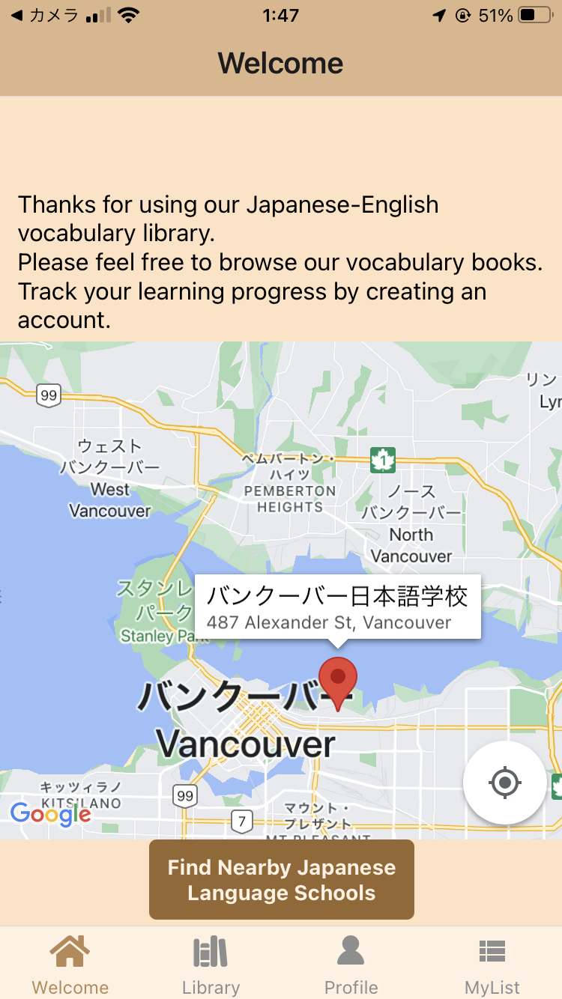

Acknowledgements/致谢/謝辞

Dedicated to Miss Y. LI.

献给李小姐

Dedicated to me, who has been studying Japanese for more than ten years, but postponed the exam plan for three years due to the COVID-2019, finally passed the Japanese Language Proficiency Test Level 2 in December 2023.

10年以上日本語を勉強してきたが、新型コロナウイルスのため試験計画を3年延期し、2023年12月についに日本語能力試験2級に合格した僕にささげられます。

Mar 7 - Apr 21

# Introduction of the application 
## The name of the application project
Words in the World

## The slogan of the application

OP! Words of the world are from the heavy bOoks, now it is inside your Phone.

## The target users of the application

Currently targeting English-speaking Japanese learners, whether they are interested in Japanese learning or preparing for Japanese-based exams. Due to the versatility of this application, it will expand in the future to include English learners whose native language is Chinese, and ultimately to learners of multiple languages worldwide.

## The description of the application

This application aims to English-speaking Japanese learners, specifically focusing on vocabulary revision for Japanese language examinations. Users can access their own vocabulary lists, mark unfamiliar words for revision, and receive timely reminders for revision sessions. Therefore, users can make full use of their spare time to review vocabulary, and they no longer need to carry heavy books. Future updates will include support for multiple languages such as Chinese- English language learning.

# Features
## Authentication
The firebase/authentication function will be used to create and store user information.

## Camera use

Ordinary users can upload or update their own avatars, and administrator users can add the cover of the word book.

## Location use

Users will use Google Maps to search for their nearest Japanese language school.

## Notification

If there are words in the user's list, a reminder menu will appear for the user to set the time. When the time is up, a banner will appear at the top of the phone to remind the user that they need to review the word.

## External API use
Use Google Maps API to search for nearby Japanese language schools

    `https://maps.googleapis.com/maps/api/place/nearbysearch/json?location=${userLocation.latitude},${userLocation.longitude}&language=ja&radius=50000&keyword=japanese%20school&key=${mapsApiKey} `

Use fetch Api to parse word books in json format and add them to the library
Example link

    https://raw.githubusercontent.com/melchiottbakery/testtesttest/main/db.json

Example json file

    [
    {
        "title": "JLPT-N2",
        "nativeLanguage": "JP",
        "number": "3",
        "translationLanguage": "GB",
        "wordlist": {
        "危ない": {"nativeWord":"危ない","translationMeaning":"dangerous" },
        "刑務所": {"nativeWord":"刑務所","translationMeaning":"jail" },
        "千代田": {"nativeWord":"千代田","translationMeaning":"chiyoda" }
        }
    }
    ]

Use Youdao Dictionary API to pronounce the selected word. 
**Non-English symbols require url-encoding.**

    `https://dict.youdao.com/dictvoice?le=jap&type3&audio=${encodedString}`

# Authenticaiton& Database& Storage

## Data structure of the application 

We use firebase as a backend database to store data.
Firebase will store three types of data.

Use authentication to store the registered user's email address and password, and provide a unique uid for each registered user.

Using storage will store the user avatar picture and the cover picture of each book in `./bookCover/` in the `./profileImage/` folder. The ID when storing is a random ID, and the storage format is jpg.

Use firestore database as database storage.

The collection library will store all the word book information documents.

The document of the word book includes the following content (example)

    document id:OGODSlFHAGff9v1qMYuJ
    imageUri:"bookCover/27CD7B4D-E0E6-4022-BBE4-7738ECCC718A.jpg"(string)
    nativeLanguage:"JP"(string)
    number:"3"(string)
    title:"JLPT-N2"(string)
    translationLanguage:"GB"(string)

    document id:random id
    imageUri: cover image of the word book, its address is the image address in storage
    nativeLanguage: the original language of the word
    number: number of words
    title: the name of the word book
    translationLanguage: the target language of the word

Corresponding to each word book, a collection called wordlist is also stored to save all the words.

    collection:wordlist

    document id: "criminal office"
    nativeWord:"Prison Office"(string)
    translationMeaning:"jail"(string)
    document id: word in original language
    nativeWord: word in the original language (same as id)
    translationMeaning: Translate the word meaning in the language

When a user successfully registers a new user, information about the user will be recorded under the users collection.

    collection: users

    document id: 1hSjn6451sR1RYieo18sBnMPvo12
    email:"2ww2w@qq.com"(string)
    imageUri:"profileImages/9884D12A-CD4E-41C7-8C1E-D99F0863724E.jpg"(string)
    isAdmin:false(boolean)
    nickname:"45678"(string)
    document id: unique identification id, the same as uid in authentication
    email: email, same as uid in authentication
    imageUri: user avatar, its address is the image address in storage
    isAdmin: whether it is an administrator
    nickname: nickname

Users can access all wordbooks in the library collection and add words to the wordlist collection under the user ID

    collection:wordlist

    document id: "広場"
    nativeWord:"広場"(string)
    nativeWordShow:true(boolean)
    remember:false(boolean)
    translationMeaning:"square"(string)
    translationMeaningShow:false(boolean)

    document id: Same as the word's original language.
    nativeWord: words in the original language
    nativeWordShow: Whether to display the original language of the word
    remember: whether to remember
    translationMeaning: the meaning of the word in the target language
    translationMeaningShow: Whether to display the target language meaning corresponding to the word

## CRUD OPRATION OF THE DATABASE

C

    C-1 users can create new users
    C-2 Create a new word book
    C-3 User will add words from library to personal word list

R

    R-1 Read the vocabulary book in the library
    R-2 User reads words from personal list
    R-3 User reads personal profile

U

    U-1 users can upload and update their own avatar
    U-2 users can upload and update covers in the library
    U-3 Users can adjust the memorization of words
    U-4 users can adjust the memory mode, including displaying only the original language, only displaying the target language, and hiding the meaning of the word.
    U-5 users can update their nickname

D

    D-1 User can delete word book
    D-2 Users can delete ‘already memorized’ words

CRUD operations on the database depend on whether the user is logged in and whether the user is an administrator.

If the user is not logged in, the user's permissions are as follows:

`C-1 R-1`

If the user is logged in and is not an administrator, the user's permissions are as follows:

`C-1 C-3 R-1 R-2 R-3 U-1 U-3 U-4 U-5 D-2`

If the user logs in as an administrator, the user's permissions are as follows:

`C-1 C-2 C-3 R-1 R-2 R-3 U-1 U-2 U-3 U-4 U-5 D-1 D-2`

# Introduction to screens of the application 

## Welcome

The user will first be directed to the welcome screen, and will see the welcome message regardless of whether they are logged in. The user can click the button at the bottom of the screen to search for Japanese language schools near them. The search will be displayed to the user using the ActivityIndicator component. The results will be displayed in Google Maps in the form of markers. The result is that the location use permission will be requested when the user clicks for the first time.

## Library

Users will browse all word books in the database here. Clicking on the word book will bring you to a new screen showing all the word details. For the admin, there will be a section in the upper right corner about opening the admin terminal. Once opened, the admin will have the option to add a word book by parsing the json link through the API, and can use the camera to add a cover to the word book. Using the camera for the first time will request camera use permission.

## Wordlist

When the user clicks on the word book, he will be directed to display all the words here. If the user logs in, he will be able to add words to his personal word library. At the same time, for the admin, there will be a delete function in the upper right corner to delete the entire word book. There will be a second confirmation before deletion.

## Profile

If the user is not logged in, a screen that requires login/registration will be displayed. When the user logs in, the user's nickname, email address, and avatar will be displayed simultaneously. Users can click on the avatar and nickname to modify it. Adding an avatar will use the camera function, and using the camera for the first time will request camera use permission. All update operations will have secondary operations. Users can logout here.

## Login 

User login screen.

## Registration

A screen for users to create new users. When the user is successfully created, user will be directed to the profile screen.

## Mylist

If the user is not logged in, this screen will not appear.
After logging in, users can add the library to their personal list. There are multiple options for filtering memorability and multiple functions for reciting words. If the user does not have a word, the user will be prompted to add a word. If there is a word in the user's word list, the remind function will appear in the upper right corner. When turned on, the user will be allowed to set reminders by themselves, and will be reminded through notifications. User notification permission will be requested. For a single word, users will be able to use the pronunciation API to pronounce the word and adjust their proficiency. Only memorized words will have a delete button.

# How to run this application correctly

    npx create-expo-app <YOUR-DIRECTORY>

To run this program correctly, you need to install the package

For navigation components

    npm install @react-navigation/native
    npm install @react-navigation/bottom-tabs
    npm install @react-navigation/native-stack

For screen components

    npx expo install expo-checkbox

For components set by firebase

    npm i @react-native-async-storage/async-storage
    npm expo install firebase
    npm install -D react-native-dotenv

For sound components

    npx expo install expo-av

For camera components

    npx expo install expo-image-picker

For location components

    npx expo install expo-location
    npx expo install react-native-maps

For reminder components

    npx expo install expo-notifications

**You need to adjust babel.config.js, please refer to our code.**
**You need to check out Firebase and the related technical documentation for creating a Google Map project.**

At the same time, you need to set up your .env

    apiKey= "<Your setting>"
    authDomain= "<Your setting>"
    projectId= "<Your setting>"
    storageBucket= "<Your setting>"
    messagingSenderId= "<Your setting>"
    appId= "<Your setting>"
    mapsApiKey= "<Your GOOGLE APIKEY>"

## Screenshots of the application

